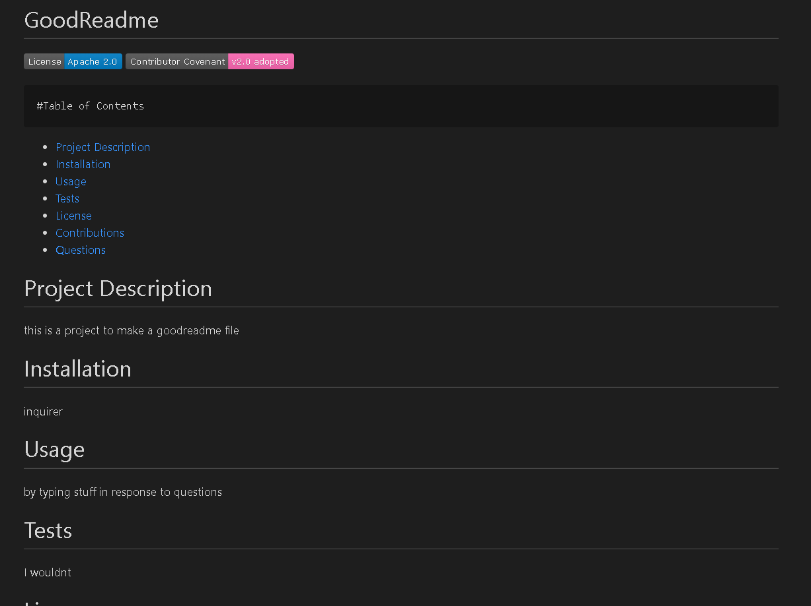

# GoodReadMe Generator Guidelines 
This application will generate a professional readme in no time from the users response to specific questions

This app uses the inquirer which is a CLI for nodeJS. The app asks users questions in response to the current project they're working on to help create a stylized, personal README file specific to what the user is working on.  This app uses Trilogy Education Services example "Good README Guide" for this template

# How the app functions
 The app will prompt the user questions specific to their app
- A description of the app
- Whats needed to install the app
- How does the user run tests or use the app
- Prompt to choose a specific license to use
- If other contributors helped make the app

DeployedApplication Video <a href="https://drive.google.com/file/d/1-GDWPBjucH7eEI7g3jqmBXtW3WpGYBnA/view">DeployedApplication</a>
